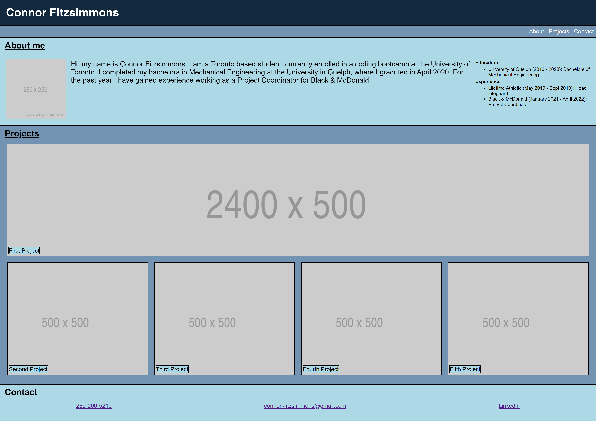

# Add Accessibility and Format HTML for Horiseon's Website

## Description

The purpose of this project is to create a personal portfolio website.  The website contains a header, navigation bar, about me section, projects section, and a contact section.  

All links on the navigation bar shall take the user to their corresponding sections.  The projects section will contain blocks of all relevant projects, highlighting the best one.  The website will be responsive when the page is resized, which will allow viewing on various screens and devices.  

## Steps Taken

1.  Created a skeleton HTML layout, including semantic tags.  Changed information in head section relative to my protfolio.

2.  Created header with a title and navigational links using anchors, set respective h-ref points for later use.  Styled section in CSS.

3.  Created about me section with a title, photo, short bio, education, and experience sections.  Used some nested flex boxes to layout images and text.  Styled in css and created flex properties to allow a clean view at multiple resoltutions.

4.  Created a projects section using nested flexboxes.  Styled in css and created flex properties to allow a clean view at multiple resoltutions.  Made main project the focus (biggest size) regardless of the resolution used.

5.  Created a contact section with phone number, email, and hyperlink to my Linkedin.  Used a flexbox to contain the three elements.  Styled in css and created flex properties to allow a clean view at multiple resoltutions.

## Picture of Website

